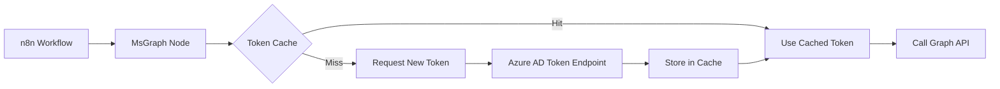

# @flagbit/n8n-nodes-msgraph - Project Index

## 📋 Table of Contents
- [Overview](#overview)
- [Project Structure](#project-structure)
- [API Reference](#api-reference)
- [Components](#components)
- [Configuration](#configuration)
- [Build & Development](#build--development)
- [Usage Guide](#usage-guide)
- [License](#license)

---

## Overview

**@flagbit/n8n-nodes-msgraph** is a community node package for n8n that provides Microsoft Graph API integration with multi-tenant support. This fork extends the original [advenimus/n8n-nodes-msgraph](https://github.com/advenimus/n8n-nodes-msgraph) to enable dynamic access to multiple Azure AD tenants using a single multi-tenant app registration.

### Key Features
- 🏢 **Multi-tenant support** - Access multiple Azure AD tenants dynamically
- 🔐 **OAuth2 authentication** - Secure client credentials flow
- 🚀 **Token caching** - Efficient token management per tenant
- 🔄 **All HTTP methods** - GET, POST, PATCH, PUT, DELETE
- ⏱️ **Rate limit handling** - Automatic retry with exponential backoff
- 📊 **Flexible responses** - JSON or string format
- 📋 **Custom headers** - Support for additional HTTP headers in requests

### Package Information
- **Name**: @flagbit/n8n-nodes-msgraph
- **Version**: 0.1.8
- **License**: MIT
- **Author**: Jörg Weller <joerg.weller@flagbit.de>
- **Repository**: [GitHub](https://github.com/flagbit/n8n-nodes-msgraph-multitenant)

---

## Project Structure

```
@flagbit/n8n-nodes-msgraph/
├── dist/                          # Compiled JavaScript output
│   ├── credentials/              
│   │   ├── MsGraphOAuth2Api.credentials.js
│   │   └── MsGraphOAuth2Api.credentials.d.ts
│   ├── icons/
│   │   └── icon.svg
│   └── nodes/
│       ├── MsGraph.node.js
│       ├── MsGraph.node.d.ts
│       └── msgraph.svg
├── icons/
│   └── icon.svg                  # Node icon
├── logs/                         # Runtime logs (git-ignored)
├── CLAUDE.md                     # Claude Code guidance
├── LICENSE                       # MIT License
├── index.js                      # Package entry point
├── package.json                  # NPM package configuration
├── readme.md                     # User documentation
└── tsconfig.json                 # TypeScript configuration
```

### File Descriptions

| File | Purpose |
|------|---------|
| `index.js` | Main entry point that exports node and credential types |
| `dist/nodes/MsGraph.node.js` | Core node implementation with multi-tenant logic |
| `dist/credentials/MsGraphOAuth2Api.credentials.js` | OAuth2 credential schema definition |
| `package.json` | NPM package manifest with n8n node registration |
| `tsconfig.json` | TypeScript compiler configuration |

---

## API Reference

### MsGraph Node

#### Node Properties

| Property | Type | Required | Description |
|----------|------|----------|-------------|
| `tenantId` | string | ✅ | Azure AD Tenant (Directory) ID |
| `method` | options | ❌ | HTTP method (GET, POST, PATCH, PUT, DELETE) |
| `url` | string | ✅ | Full Microsoft Graph API URL |
| `queryParameters` | collection | ❌ | URL query parameters |
| `body` | json | ❌ | Request body (for POST, PATCH, PUT) |
| `responseFormat` | options | ❌ | Response format (json or string) |

#### Node Configuration

```javascript
{
  displayName: 'Microsoft Graph Multi-Tenant',
  name: 'msGraph',
  icon: 'file:msgraph.svg',
  group: ['transform'],
  version: 1,
  inputs: ['main'],
  outputs: ['main'],
  credentials: [{
    name: 'msGraphOAuth2Api',
    required: true
  }]
}
```

### MsGraphOAuth2Api Credentials

#### Credential Properties

| Property | Type | Required | Description |
|----------|------|----------|-------------|
| `clientId` | string | ✅ | Azure AD Application (client) ID |
| `clientSecret` | password | ✅ | Client secret for authentication |
| `scope` | string | ✅ | Space-separated list of scopes |
| `authentication` | options | ❌ | Authentication type (header or body) |

---

## Components

### 1. Authentication Flow



### 2. Token Management

The node implements an efficient token caching mechanism:

1. **Per-tenant caching** - Tokens cached by tenant ID within execution
2. **Client credentials flow** - Uses app-only authentication
3. **Automatic token fetch** - Retrieves tokens on-demand
4. **Session scoped** - Cache persists only during workflow execution

### 3. Error Handling

- **Rate limiting** - Automatic retry with exponential backoff (max 5 retries)
- **Token failures** - Clear error messages for authentication issues
- **JSON parsing** - Validates request body format
- **Continue on fail** - Optional error handling mode

---

## Configuration

### TypeScript Configuration

```json
{
  "compilerOptions": {
    "target": "ES2020",
    "module": "CommonJS",
    "lib": ["ES2020"],
    "declaration": true,
    "outDir": "./dist",
    "rootDir": "./",
    "strict": true,
    "esModuleInterop": true,
    "skipLibCheck": true,
    "forceConsistentCasingInFileNames": true
  }
}
```

### n8n Package Registration

```json
{
  "n8n": {
    "n8nNodesApiVersion": 1,
    "credentials": [
      "dist/credentials/MsGraphOAuth2Api.credentials.js"
    ],
    "nodes": [
      "dist/nodes/MsGraph.node.js"
    ]
  }
}
```

---

## Build & Development

### Prerequisites
- Node.js (v18+)
- npm or yarn
- TypeScript 4.9+

### Commands

| Command | Description |
|---------|-------------|
| `npm run build` | Compile TypeScript to JavaScript |
| `npm run dev` | Watch mode for development |

### Development Dependencies
- `@types/node`: ^18.0.0
- `@typescript-eslint/eslint-plugin`: ^8.26.1
- `@typescript-eslint/parser`: ^8.26.1
- `eslint`: ^8.57.1
- `eslint-plugin-n8n-nodes-base`: ^1.16.1

### Runtime Dependencies
- `n8n-core`: ^1.0.0
- `n8n-workflow`: ^1.0.0
- `typescript`: ^4.9.0

---

## Usage Guide

### Installation

1. **Via n8n UI**: Settings → Community Nodes → Install `@flagbit/n8n-nodes-msgraph`
2. **Manual**: Clone repository into n8n custom nodes directory

### Azure AD Setup

1. Create multi-tenant app registration in Azure Portal
2. Set supported account types to "Any Azure AD directory - Multitenant"
3. Create client secret or certificate
4. Add required Graph API permissions
5. Grant admin consent
6. Share consent URL with tenant admins

### Workflow Configuration

1. Add "Microsoft Graph Multi-Tenant" node to workflow
2. Configure OAuth2 credentials with client ID and secret
3. Set tenant ID (dynamically via expression or statically)
4. Configure API endpoint and parameters
5. Execute to fetch data from Microsoft Graph

### Example Use Cases

- **User Management**: List users across multiple tenants
- **Group Operations**: Manage groups in different organizations
- **Email Integration**: Send emails via Microsoft Graph
- **Directory Sync**: Synchronize directory data across tenants
- **Report Generation**: Aggregate data from multiple tenants

---

## License

MIT License - Copyright © 2025 ikbendion

Forked from [advenimus/n8n-nodes-msgraph](https://github.com/advenimus/n8n-nodes-msgraph)

---

## Quick Links

- [Microsoft Graph Documentation](https://docs.microsoft.com/en-us/graph/)
- [n8n Documentation](https://docs.n8n.io/)
- [Azure AD Multi-tenant Apps](https://learn.microsoft.com/en-us/azure/active-directory/develop/howto-convert-app-to-be-multi-tenant)
- [Project Repository](https://github.com/flagbit/n8n-nodes-msgraph-multitenant)